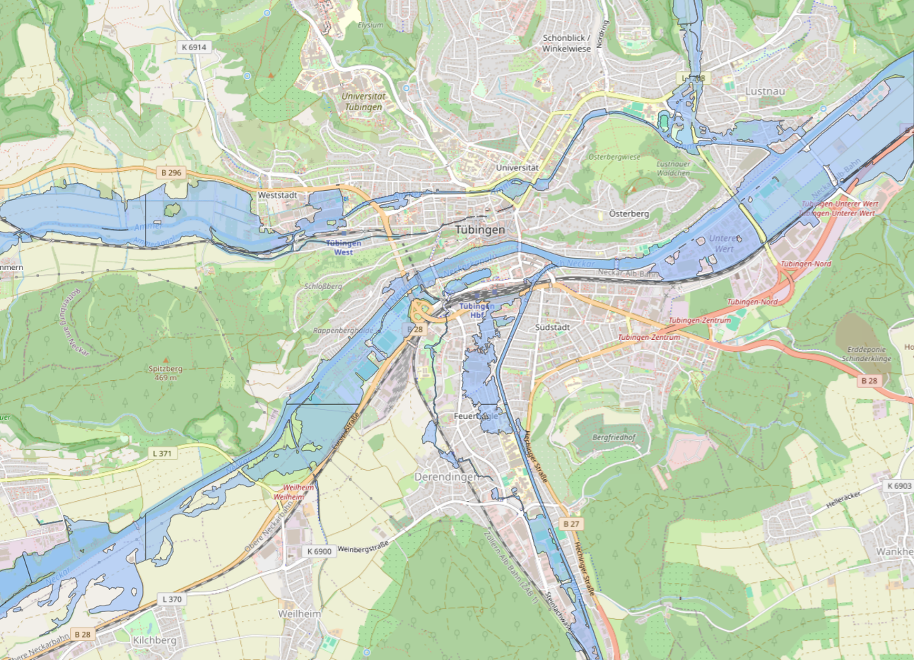
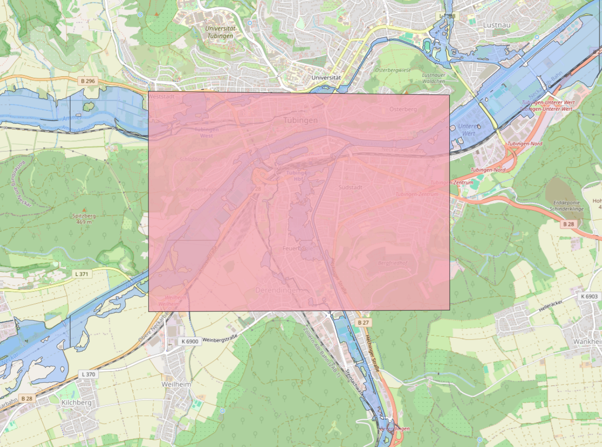
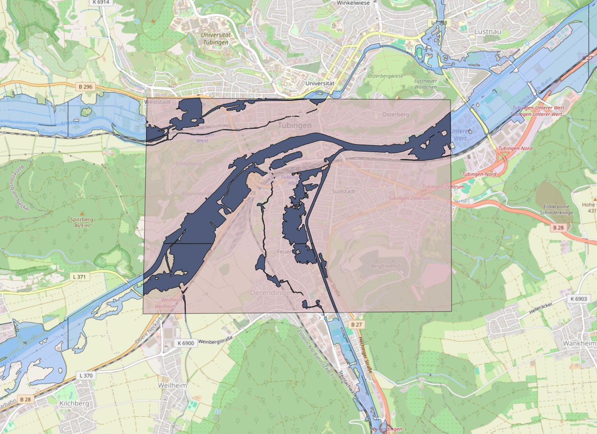
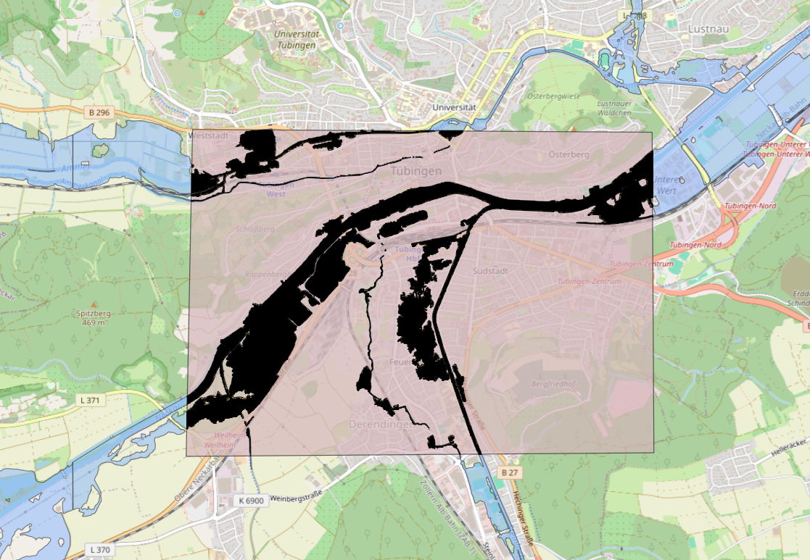

# Flood Risk Analysis Tool

img
 
*An image description*

## Code Description
Purpose, Motivation, Goals

## Usage (run) instructions
split into sections:
To run this tool, sample data is provided within the /data/ folder. You will find a inundation depth GeoTIFF,
flow velocity GeoTIFF that can be selected with the tool. If you wish to generate your own inundation depth GeoTIFF,
the following section provides information on how to do so:

The first step is open the provided UF_HQ10, UF_HQ100, or UF_HQextreme(?) shapefiles in QGIS. These are provided by
https://udo.lubw.baden-wuerttemberg.de/public/ from Water -> Flood -> Floodplains download. After opening your desired
map in QGIS and optionally loading a basemap, navigate to your area of flood risk analysis. In this example, we will
use Tubingen as our area of study, with the UF_HQ100 shapefile loaded. (corresponding to a 100-year return period flood).

Next, we want to create a new temporary scratch layer and draw a polygon around the area which we want to study. While creating
the temporary scratch layer, ensure that it uses a polygon geometry type and is set to a CRS of EPSG:25832 (the same CRS as the UF_HQ100). No field data needs
to be entered. After drawing the polygon shape, be sure to save layer edits and toggle editing off. You should now have something like this:

opacity reduced for visual clarity

Now, in the processing tool box, search clip vector by mask. Set the input layer as the UF_HQ100, and the mask layer as the
temporary scratch layer. Both should be on the same CRS. Click "Run" and a new, clipped vector layer will appear.

The next step is to export the clipped layer, so that we can reproject the data to EPSG 3857. To do this, right click on the
clipped layer that we just made, and select Export > Save Features As. Name the file and layer as you'd like, but be sure to
set the CRS to EPSG 3857. This is done to easily vectorize the raster. After exporting the layer, it will open automatically
in your layers and it will be overlaid on top of your previous layer.

Finally, we need to turn the reprojected vector drawing into a raster, so that it can be used by the flood risk analysis tool. To
do so, open the Raster tab in the top row and select Conversion > Rasterize (Vector to Raster). In the dialog box, select
the clipped layer as the input layer. Under "A fixed value to burn" enter 1. The output raster size units should be Georeferenced units,
and for the x- and y-resolution enter anything between 10-20. The higher the value, the coarser the raster will be. To set the
output extent, click on the dropdown arrow > Calculate from layer > choose the reprojected vector layer that you named

You will now have a rasterized inundation map for a given return period, for your area of study. You can now export this layer
by right clicking on it and selecting export. Save the file as you'd like, ensuring that the CRS is EPSG 3857.

s1 get inundation maps from qgis - DONE
s2 get flow velocity maps
One optional input parameter is a flow velocity raster. It is assumed that this would be generated from numerical simulation
beyond our scope. For completeness, we have included a simplistic flow velocity raster in our sample data.

s3 explain how to run the python
To use the tool, you should already have a prepared inundation map. Launch the main.py script and a GUI will open, prompting you
for a return period, no data value, inundation raster file, flow velocity raster file (optional), and an output directory. There is also an option to generate a PDF report for easier visualization.

| Parameter          | Example Value                                          | Notes                                                                                                                                                                                        |
|--------------------|--------------------------------------------------------|----------------------------------------------------------------------------------------------------------------------------------------------------------------------------------------------|
| Return Period      | 100                                                    | Use the return period for the inundation map that you have selected, ie. 10, 100, 1000                                                                                                       |
| No Data Value      | -999                                                   | Cells that are calculated with no data will appear as black when you export to QGIS, unless a no data value is used. This helps with clarity of the output. Any negative integer is suitable |
| Inundation File    | C:\Users\####\PycharmProjects\FloodRisk\Inundation.tif | The file path to your inundation map. Use the file browser to select.                                                                                                                        |
| Flow Velocity File | C:\Users\####\PycharmProjects\FloodRisk\Velocity.tif   | The file path to your (optional) flow velocity map. Use the file browser to select.                                                                                                          |
| Output Directory   | C:\Users\####\PycharmProjects\FloodRisk\Results        | The directory that results will be stored in, after the tool finishes.                                                                                                                       |
| Generate PDF       | Yes/No                                                 | An optional feature to generate a PDF output.                                                                                                                                                |

Once you click run, the tool will begin. If you choose to
generate a raster, clicking the run button may cause the tool to appear stuck- this is not the case, it just needs some time (not longer
than 30 seconds) to generate the pdf.

s4 explain the results
Results will be outputted to the directory which you selected. You will find the following results:
- land_use_risk.csv
- raster_comparison.csv
- summary_table.csv
- risk_output.tif
- output.pdf

## Requirements (incl all non-standard python libraries)
These are the required packages to run the tool.
The following list was compiled with pipreqs

- contextily==1.6.2
- matplotlib==3.8.4
- numpy~=1.26.4
- pandas==2.2.3
- Pillow~=10.4.0
- rasterio~=1.4.3
- scikit-image~=0.23.2
- reportlab~=4.2.5

## Code diagram (ie. UML)

## Docs of all functions incl. custom classes
