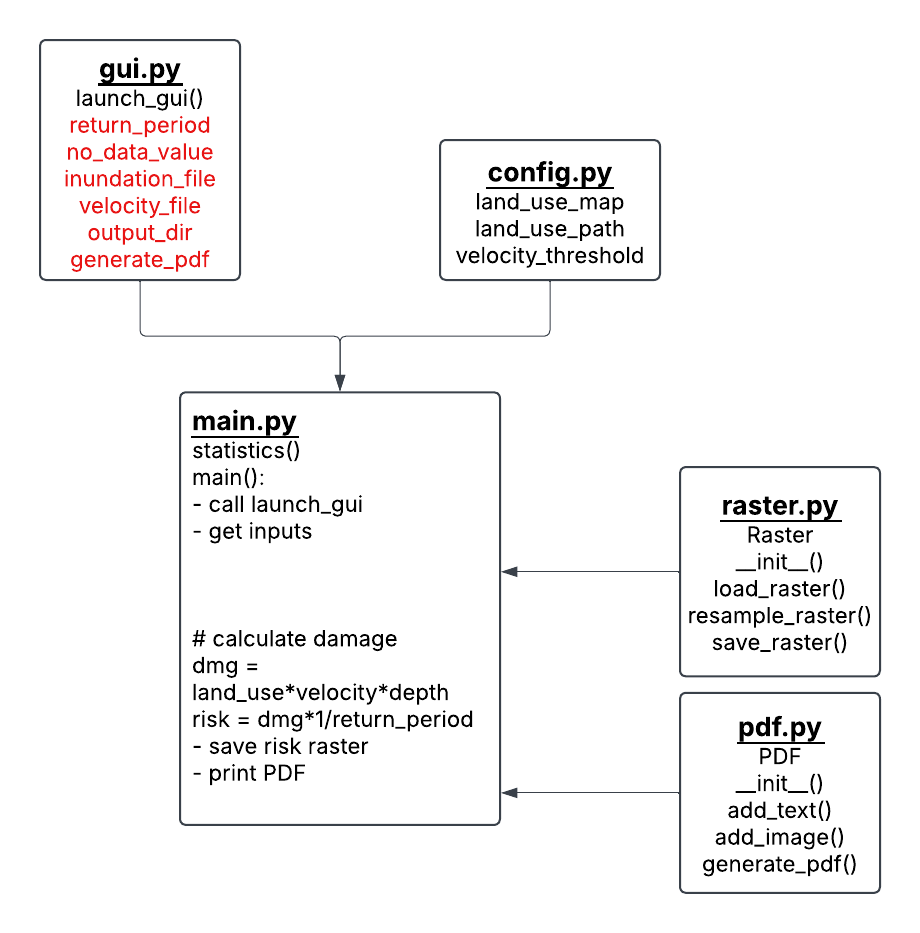

# Flood Risk Analysis Tool
This tool is a Python-based application designed to assess flood risk by analyzing flood inundation,
flow velocity, and land use data for Baden-Württemberg. It provides insights into potential flood damage and
generates a tif file that can easily be viewed in QGIS, a PDF report for easy sharing, and statistics.

## Motivation
With global warming leading to increased precipitation, many municipalities—especially those with water courses—will be at an increased risk of flooding. If municipalities are not prepared to handle flooding, they can lead to significant damages. This tool is designed to help municipalities determine flood risk, so that they can prepare solutions before problems arise.

## Goals
The goals of this tool are to process inundation, flow velocity and land use into a single flood risk raster, providing a
clear overview of the high flood risk areas in a municipality. From a programming perspective, this project also serves as an opportunity to deepen our understanding of Python and geospatial data management.

## Usage Instructions
The following steps should be followed to run the tool:
1. Clone the repository
2. Open the project in your IDE of choice (PyCharm)
3. Set Python 3.12 as the Python Interpreter
4. Open the terminal and run `pip install -r requirements.txt`, or any method to install dependencies
5. Run the main.py script
6. *Input the sample data into the GUI
7. Click "Run Script"

*Sample data is included in the /data/ folder for two different cities in Baden-Württemberg: Biberach and Tübingen. Click the "Browse.." button in the GUI, and then navigate to the /data/ folder. Select either the
BiberachInundation or TubingenInundation files under the "Inundation File" field, and optionally add the
BiberachVelocity or TubingenVelocity files under the "Flow Velocity File" field. A /results/ folder is
included in the project structure, which can be selected for the "Output Directory" field.

Results will be outputted to whichever directory you selected. The following files will be created:
- risk_output.tif - a GeoTIFF image that can be opened in QGIS to view the flood risk results
- FloodRiskAnalysis.pdf - a PDF file showcasing the calculated flood risk, overlaid on an OpenStreetMap image
- land_use_risk.csv - a CSV file containing the total pixel count of each risk category
- summary_table.csv - a CSV file containing the mean, median, standard deviation, minimum and maximum raster values 

If you wish to create your own flood inundation maps, or learn more about our process to create the provided sample maps for Biberach and Tübingen, please see the information provided on our [**GitHub Pages.**](https://shun456789.github.io/Flood-Risk-Analysis-Tool/usage/)

## Requirements
These are the dependencies required to run the tool. The following list was compiled with pipreqs. They are also in the requirements.txt file, and can be installed with `pip install -r requirements.txt`

- contextily==1.6.2
- matplotlib==3.8.4
- numpy~=1.26.4
- pandas==2.2.3
- Pillow~=10.4.0
- rasterio~=1.4.3
- scikit-image~=0.23.2
- reportlab~=4.2.5

## Code Diagram
The following UML provides a general flowchart of how the tool operates, and how each script plays a role in the tool. Functions are shown as well.

## Docs of all functions incl. custom classes
actions, input arguments and output incl. data types
