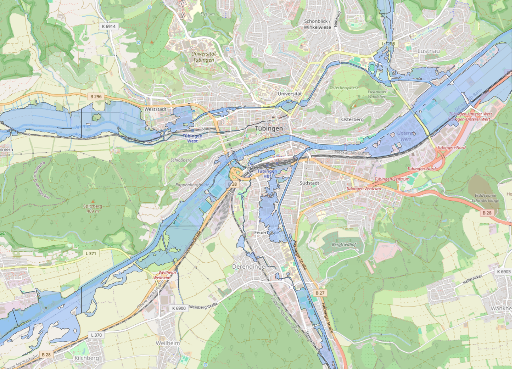
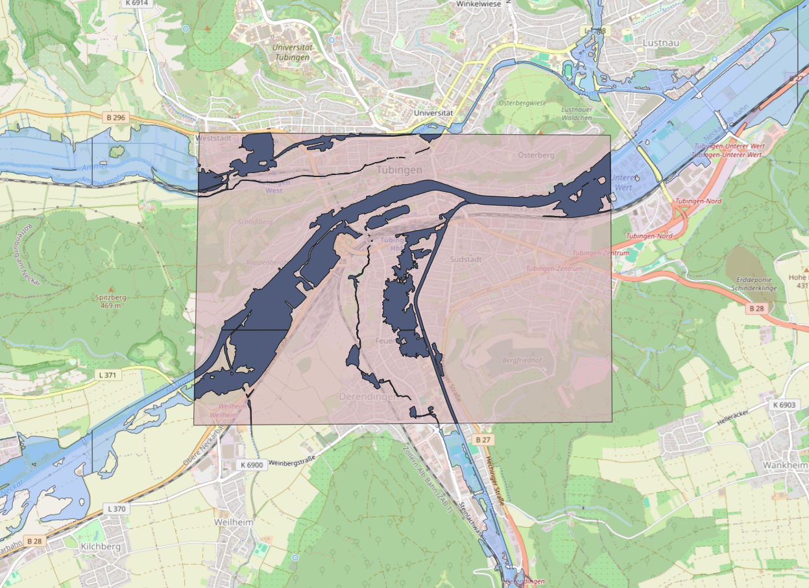
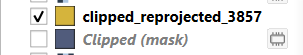

## Creating Your Own Inundation Raster
To run the Flood Risk Analysis tool, sample inundation and flow velocity rasters for two different locations are
provided within the /data/ folder that can be used with the tool. If you wish to generate your own inundation GeoTIFF,
the following section provides information on how to do so. You will need QGIS.

The first step is to download the inundation shapefiles provided by the LUBW, and open them in QGIS. To keep our project size small,
we have not included these files in the repository. To download them, first go to
https://udo.lubw.baden-wuerttemberg.de/public/ and with the panel on the left, open Wasser -> Hochwasser -> Hochwassergefahrenkarten.
Click the second option to download the zip file (size ~250Mb). The downloaded file should be named HWGK_UF. This zip file contains 
inundation zones for 10, 50, 100 and extreme return periods.

Now, open QGIS and go to Layer -> Add Layer -> Add Vector Layer. Select the zip file that you downloaded earlier, and click Add. A pop-up
will ask you which of the layers you wish to add. In this example, we will only add the UF_HQ100 layer, which corresponds to a 100-year return period flood.

You should now have the UF_HQ100 map added to QGIS. Drag the OpenStreetMap XYZ tile into the window to also add a basemap to the window. Now, navigate to the area 
for which you would like to create a flood risk summary. In this example, the city of Tübingen will be used.

Now, we want to create a new temporary scratch layer and draw a polygon around our area of study. Select Layer -> Create Layer -> New Temporary Scratch Layer.
Select Polygon for the geometry type and set the CRS to EPSG:25832 (the same CRS as the UF_HQ100). No field data needs
to be entered. Now select Add Polygon Feature and draw a rectangle around your area of study, and right click to complete it. After drawing the polygon shape, be sure to save the layer edits and toggle editing off. You should now have something like this:

In the Processing Toolbox on the right side, search "Clip vector by mask". Set the input layer as UF_HQ100, and the mask layer as the
temporary scratch layer. Both should be on the same CRS of EPSG:25832. Click "Run" and a new, clipped vector layer will appear.

The next step is to export the clipped layer, so that we can reproject it to EPSG 3857. In the Layers box in the bottom left, right-click on the
clipped layer that we just made, and select Export > Save Features As. Be sure to
set the CRS to EPSG 3857. Name the file and layer as you'd like. After exporting the layer, it will open automatically
in your project.

Finally, we need to turn the reprojected vector layer into a raster image so that it can be used by the flood risk analysis tool.
Select Raster -> Conversion -> Rasterize (Vector to Raster). In the dialog box, select
the reprojected vector layer as the input layer. It should have a CRS of EPSG 3857. Under the "A fixed value to burn" field, enter "1". The "Output raster size units" should be "Georeferenced units".
The "Width/Horizontal Resolution" and "Height/Vertical Resolution" should be an integer between 10 and 20. The higher the value, the coarser the raster image will be. Important: set the
"Output extent" by clicking on the dropdown arrow -> Calculate from layer -> Select the reproject vector layer (EPSG 3857). Now click Run.

You will now have a rasterized flood layer in the Layers panel. Export this layer by right-clicking on it -> Export -> Save As. Name the file as you'd like. No changes are needed to the rest of the options.
You have now created an inundation raster image for your area of study for a given return period, that can be used by the flood risk analysis tool. Now, you can run the tool and test out your flood raster image.